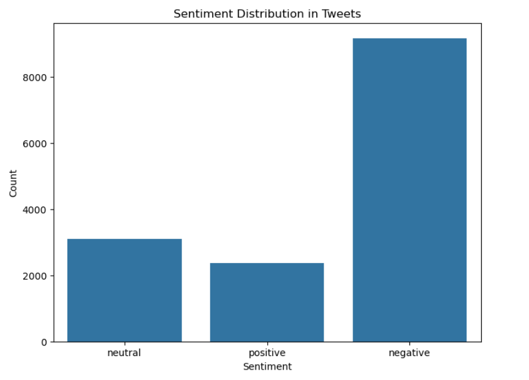
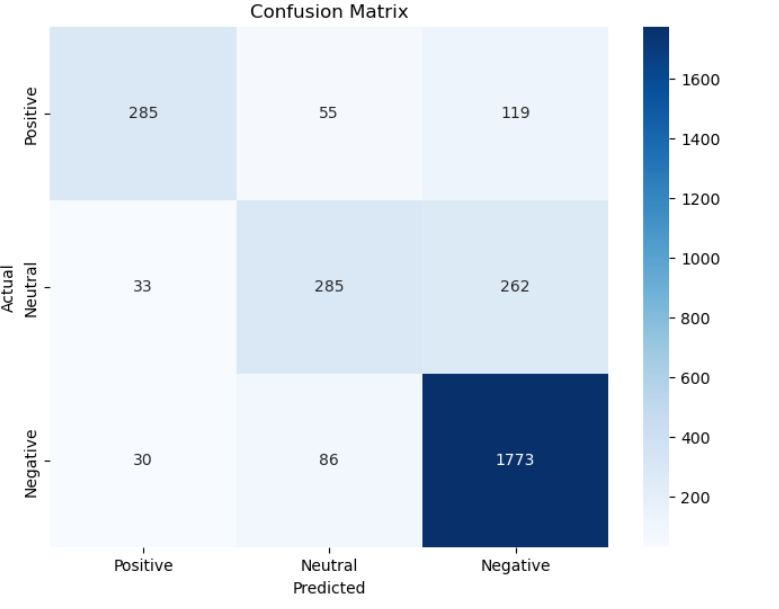

# Airline Tweet Sentiment Analysis

**Author:** Nicolette Mtisi  
**Tools:** Python · NLTK · scikit-learn · pandas · Matplotlib · Seaborn

## Overview
This NLP project sorts airline customer tweets into **positive**, **neutral** or **negative** sentiment. Airlines get thousands of these messages every day, and an automatic classifier helps customer-experience teams spot complaints and trends without reading every tweet by hand.

**Dataset:** [Twitter US Airline Sentiment](https://www.kaggle.com/datasets/crowdflower/twitter-airline-sentiment) (Kaggle), 14,640 tweets about six U.S. airlines. It is included here as `Tweets.csv`.

## Approach
1. **Text cleaning:** lowercasing and removing URLs, @mentions, #hashtags and punctuation.
2. **NLP preprocessing** with NLTK: tokenization, stopword removal and lemmatization.
3. **Features:** TF-IDF vectorization, keeping the top 5,000 terms.
4. **Model:** Logistic Regression trained on an 80/20 train/test split.
5. **Evaluation:** accuracy, a per-class classification report and a confusion matrix.

## Results
**Accuracy: 80.0%** on the held-out test set (2,928 tweets).

| Sentiment | Precision | Recall | F1 | Test Tweets |
|-----------|----------:|-------:|---:|------------:|
| Negative | 0.82 | 0.94 | 0.88 | 1,889 |
| Neutral | 0.67 | 0.49 | 0.57 | 580 |
| Positive | 0.82 | 0.62 | 0.71 | 459 |

| Sentiment Distribution | Confusion Matrix |
|:---:|:---:|
|  |  |

**Key takeaways**
- Negative tweets make up about 63% of the data, and the model detects them very reliably (94% recall).
- **Neutral** is the hardest class. These tweets are often questions or plain statements that share wording with the other two classes.
- Example: *"I love the friendly service on this airline!"* is classified as **positive**.

## How to Run
```bash
git clone https://github.com/nic-stack/Twitter-Sentiment-Analysis.git
cd Twitter-Sentiment-Analysis
pip install -r requirements.txt
jupyter notebook sentiment_analysis.ipynb
```
The notebook downloads the NLTK resources it needs (punkt, stopwords, wordnet) on the first run.

## Files
| File | Description |
|------|-------------|
| `sentiment_analysis.ipynb` | Full pipeline: preprocessing, training, evaluation and charts |
| `Tweets.csv` | Twitter US Airline Sentiment dataset |
| `sentiment_distribution.png` | Class distribution chart |
| `confusion_matrix.png` | Test-set confusion matrix |
| `requirements.txt` | Python dependencies |

## Next Steps
- Handle the class imbalance with class weights or resampling to improve neutral and positive recall.
- Compare against transformer models. A follow-up project fine-tuned **DistilBERT** on this task ([model](https://huggingface.co/Nicolettem/bert-sentiment-nic) · [live demo](https://huggingface.co/spaces/Nicolettem/bert_sentiment_demo)).

## Links
- 📝 [Medium write-up](https://medium.com/@nicmtisi/decoding-user-feedback-my-twitter-sentiment-analysis-project-with-python-da7f2ba8d513)
- 🌐 [Portfolio](https://nic-stack.github.io/NicoletteMtisi/) · [LinkedIn](https://www.linkedin.com/in/nicolette-mtisi)
